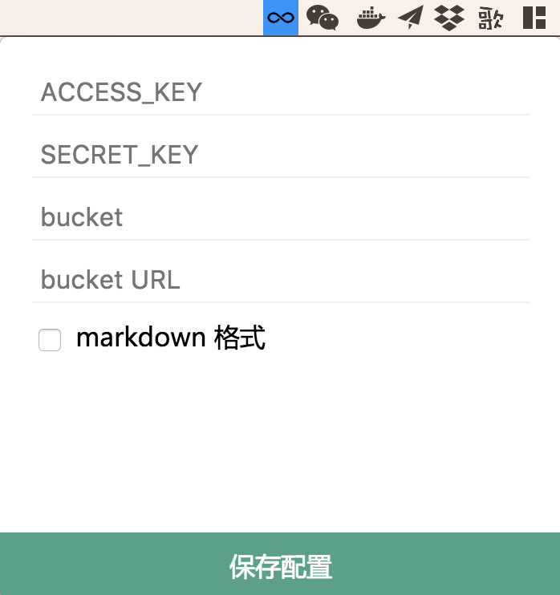

# Zoe

快捷上传文件到七牛云 for macOS


## Get Started



配置好后直接将文件拖到这个图标上就会自动上传了，上传成功后会将文件的 URL 直接写到粘贴板中，直接在你需要的地方粘贴就行了，结果如下：

```markdown

```

如果你没有勾选 markdown 格式选项的话就只是一个 URL：

```
http://img.l.jifangcheng.com/58fb63c6769e0c99009a2285ab40293c329ce09e.jpg
```

上传的文件名使用文件内容的哈希值（SHA1）以保证相同的文件无论上传多少次，在七牛云上都只会有一份。

如果有多个文件，那文件会依次上传，最后得到的结果也是多个，示例如下：

```markdown


```

要退出程序的话直接在配置页面按 Cmd+Q（退出应用程序的快捷键）就行了。
